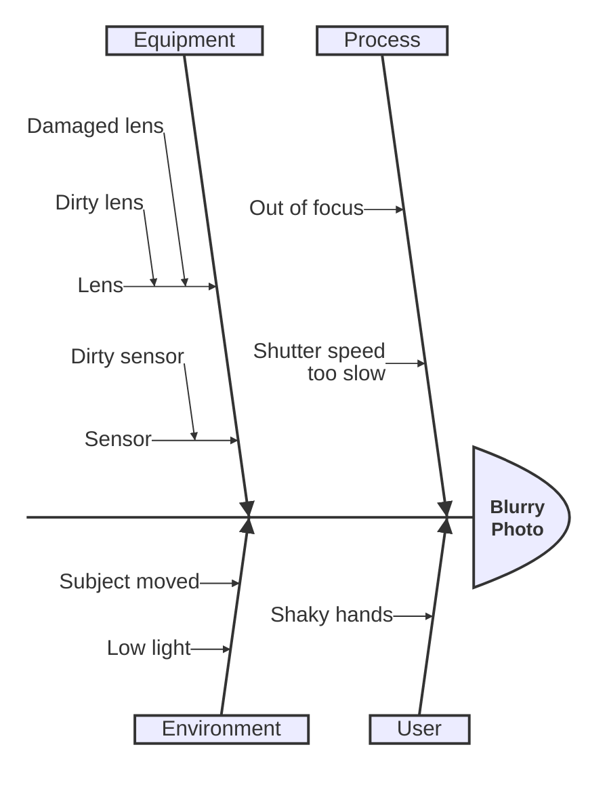

```mermaid
ishikawa-beta
    Blurry Photo
    Process
        Out of focus
        Shutter speed too slow
    User
        Shaky hands
    Equipment
        Lens
            Damaged lens
            Dirty lens
        Sensor
            Dirty sensor
    Environment
        Subject moved
        Low light
```

## Syntax

- The first line is the effect, at the head of the fish.
- Each line indented under it is a category, and each under those a cause; deeper indentation nests causes.
