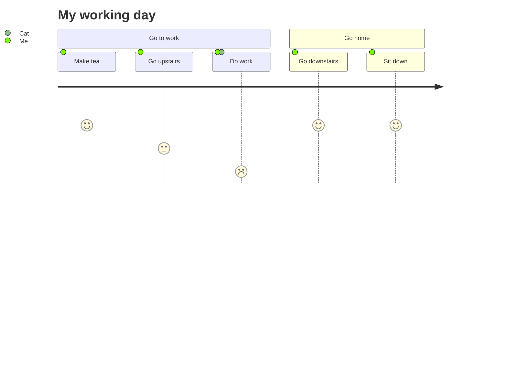

```mermaid
journey
    title My working day
    section Go to work
      Make tea: 5: Me
      Go upstairs: 3: Me
      Do work: 1: Me, Cat
    section Go home
      Go downstairs: 5: Me
      Sit down: 5: Me
```

## Syntax

- `title` names the journey; `section` starts a stage.
- `Task: score: Actor, Actor` is a step, scored 1 to 5.
