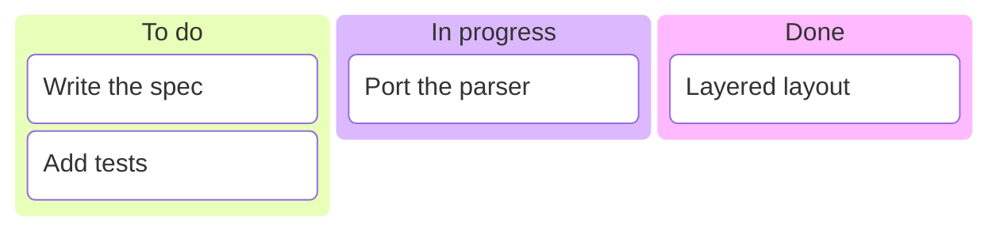

```mermaid
kanban
  todo[To do]
    spec[Write the spec]
    tests[Add tests]
  doing[In progress]
    parser[Port the parser]
  done[Done]
    layout[Layered layout]
```

## Syntax

- An unindented `id[Title]` is a column; each indented one under it is a card.
- `@{ assigned: …, ticket: …, priority: … }` after a card adds its metadata.
