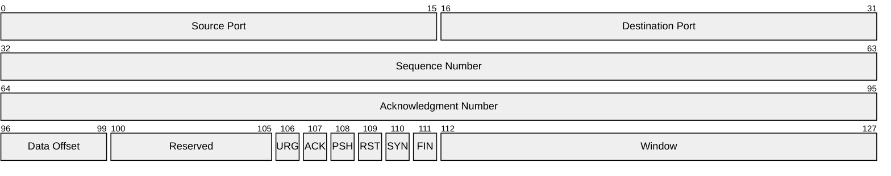

```mermaid
packet
0-15: "Source Port"
16-31: "Destination Port"
32-63: "Sequence Number"
64-95: "Acknowledgment Number"
96-99: "Data Offset"
100-105: "Reserved"
106: "URG"
107: "ACK"
108: "PSH"
109: "RST"
110: "SYN"
111: "FIN"
112-127: "Window"
```

## Syntax

- `start-end: "Field"` is a field over a range of bits; `n: "Flag"` one bit.
- Rows are 32 bits wide.
