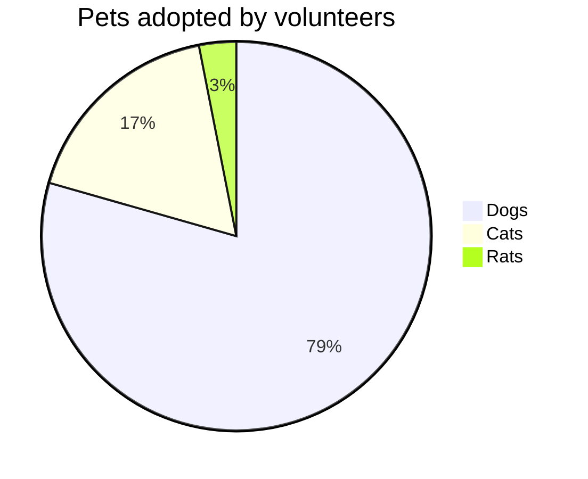

```mermaid
pie title Pets adopted by volunteers
    "Dogs" : 386
    "Cats" : 85
    "Rats" : 15
```

## Syntax

- `pie` and an optional `title`; `showData` prints each value beside its label.
- `"Label" : value` is a slice.
