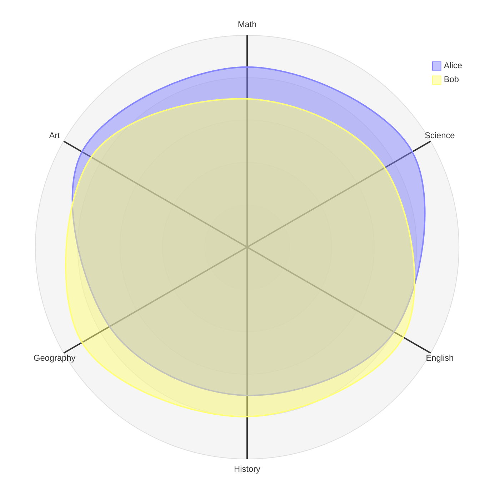

```mermaid
radar-beta
  axis m["Math"], s["Science"], e["English"]
  axis h["History"], g["Geography"], a["Art"]
  curve a["Alice"]{85, 90, 80, 70, 75, 90}
  curve b["Bob"]{70, 75, 85, 80, 90, 85}

  max 100
  min 0
```

## Syntax

- `axis id["Label"], …` declares the axes.
- `curve id["Label"]{v, v, …}` adds a curve, one value per axis.
- `max` and `min` set the scale; `graticule` and `ticks` its rings.
