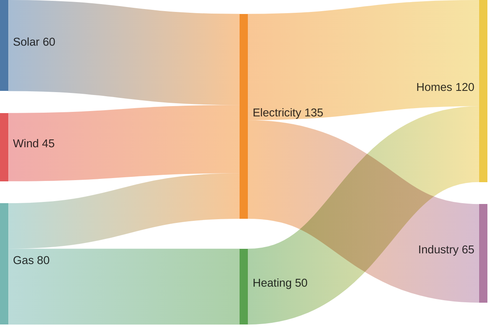

```mermaid
sankey

Solar,Electricity,60
Wind,Electricity,45
Gas,Electricity,30
Gas,Heating,50
Electricity,Homes,70
Electricity,Industry,65
Heating,Homes,50
```

## Syntax

- After the header, each line is `source,target,value` — CSV, with quotes around a name holding a comma.
