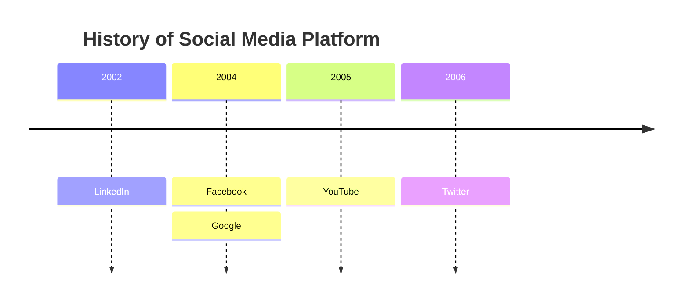

```mermaid
timeline
    title History of Social Media Platform
    2002 : LinkedIn
    2004 : Facebook
         : Google
    2005 : YouTube
    2006 : Twitter
```

## Syntax

- `period : event` adds an event; `: event` on the next line adds another to the same period.
- `section` groups periods; `title` names the timeline.
