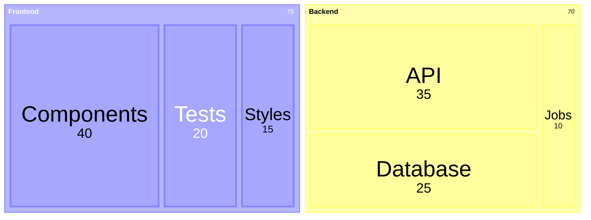

```mermaid
treemap-beta
"Frontend"
    "Components": 40
    "Styles": 15
    "Tests": 20
"Backend"
    "API": 35
    "Database": 25
    "Jobs": 10
```

## Syntax

- Indentation nests: a quoted name alone is a section, `"Name": value` a leaf.
- A section's area is the sum of its leaves.
