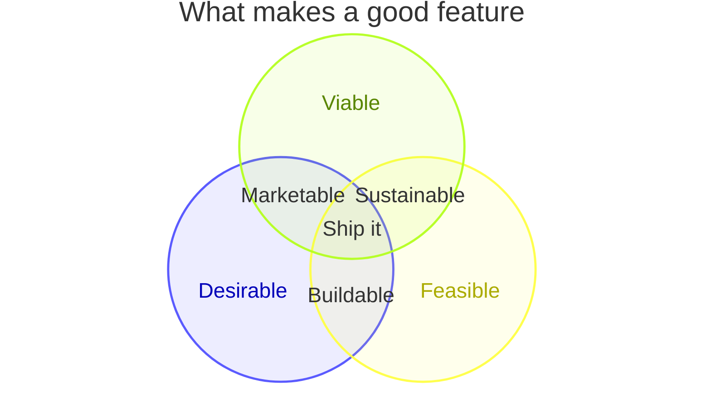

```mermaid
venn-beta
  title What makes a good feature
  set Desirable
  set Feasible
  set Viable
  union Desirable,Feasible["Buildable"]
  union Feasible,Viable["Sustainable"]
  union Desirable,Viable["Marketable"]
  union Desirable,Feasible,Viable["Ship it"]
```

## Syntax

- `set Name` declares a set.
- `union A,B["Label"]` labels where sets overlap.
- `title` names the diagram.
